# Bedrock Vault — Full System Flow Documentation

> **Application:** Bedrock Vault v1.0.0  
> **Architecture:** Electron (Main + Renderer + Preload) with Native C++ Addon  
> **Audience:** Developers, Auditors, Future Maintainers  
> **Generated From:** Complete repository analysis — every step verified against actual code

---

## Table of Contents

1. [System Overview](#1-system-overview)
2. [User Entry Flow](#2-user-entry-flow)
3. [Encryption Flow](#3-encryption-flow)
4. [Decryption Flow](#4-decryption-flow)
5. [Metadata Flow](#5-metadata-flow)
6. [Recovery Flow](#6-recovery-flow)
7. [Threading Flow](#7-threading-flow)
8. [IPC Flow](#8-ipc-flow)
9. [Validation Flow](#9-validation-flow)
10. [Error Handling Flow](#10-error-handling-flow)
11. [Logging Flow](#11-logging-flow)
12. [Security Flow](#12-security-flow)

---

## 1. System Overview

### High-Level Architecture

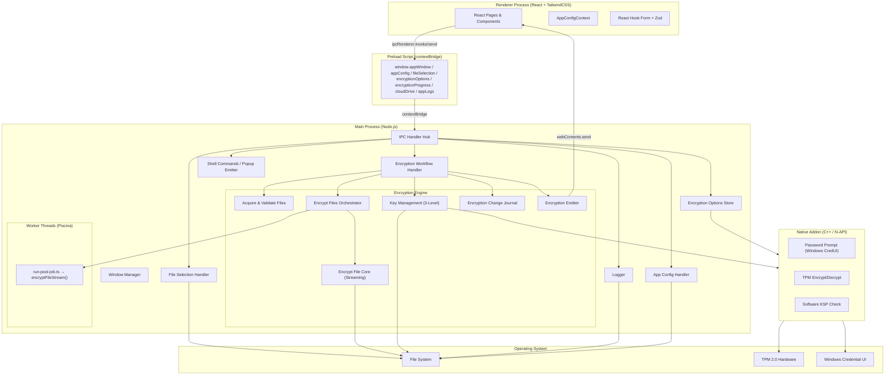

### Process Model

| Process | Technology | Role |
|---|---|---|
| Main Process | Node.js (Electron) | App lifecycle, IPC hub, file I/O, encryption engine, native addon loading |
| Renderer Process | React 19, TailwindCSS 4, React Hook Form, Framer Motion | UI, form validation (client-side), navigation, progress display |
| Preload Script | Electron contextBridge | Secure bridge — exposes typed API surface to renderer |
| Worker Threads | Piscina thread pool | Parallel file encryption for large files (>512 KB) |
| Native Addon | C++ (N-API, node-addon-api) | Windows Credential UI password prompt, TPM encryption/decryption |

### Key Dependencies

| Dependency | Purpose |
|---|---|
| `piscina` | Worker thread pool for parallel encryption |
| `proper-lockfile` | File locking during encryption to prevent concurrent access |
| `systeminformation` | Disk space and drive info queries |
| `fs-extra` | Extended file system operations |
| `zod` | Schema validation for forms and configs |
| `react-hook-form` | Form state management with resolver-based validation |
| `framer-motion` | UI animations |
| `node-addon-api` | N-API bindings for native C++ addon |

---

## 2. User Entry Flow

### Application Bootstrap

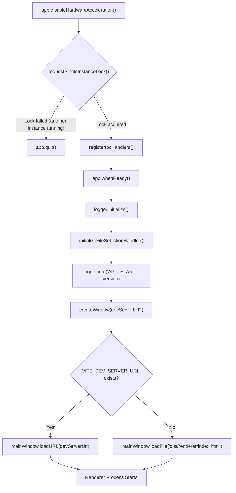

**Module:** `src/main/main.ts`

**Decision Points:**
- **Single Instance Lock:** Uses `app.requestSingleInstanceLock()`. If another instance is already running, the new instance quits immediately. The existing instance receives a `second-instance` event and focuses/restores its window.
- **Dev vs Production:** Window loads a Vite dev server URL or the built HTML file based on the `VITE_DEV_SERVER_URL` environment variable.

### Renderer Bootstrap

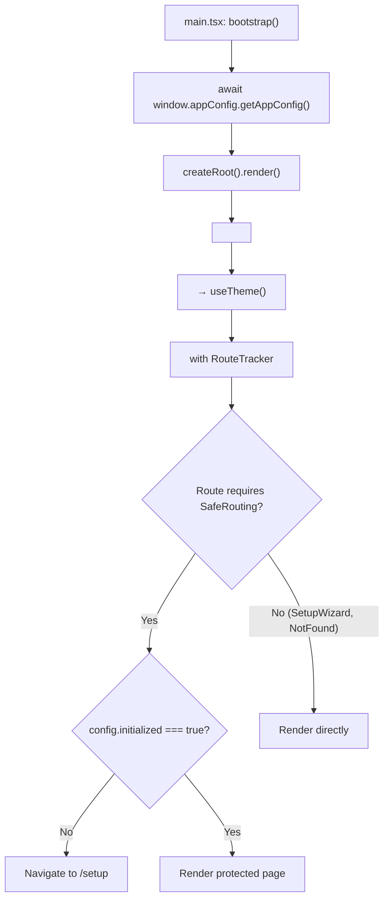

**Module:** `src/renderer/main.tsx`, `src/renderer/App.tsx`, `src/renderer/components/SafeRouting.tsx`

**Decision Points:**
- **SafeRouting Guard:** All routes except `/setup` and `*` (NotFound) are wrapped in `<SafeRouting>`. This component checks `ctx.config.initialized`. If `false`, it redirects to `/setup` (the Setup Wizard). This ensures first-time users complete setup before accessing any feature.

### Window Configuration

| Property | Value |
|---|---|
| Dimensions | 1000×700 (fixed, not resizable) |
| Frame | Frameless (`frame: false`) |
| Resizable | No |
| Fullscreenable | No |
| Menu Bar | Auto-hidden |
| Preload | `dist/preload/preload.mjs` |

**Module:** `src/main/window-manager.ts`

### Logs Window

A secondary `BrowserWindow` (850×600, frameless, resizable) can be opened for viewing logs. It loads the `#/logs` hash route. Closing the main window cascades to close the logs window.

---

## 3. Encryption Flow

### Master Encryption Workflow

This is the most complex flow in the application. It is orchestrated by `handleStartEncryptionWorkflow()` in `encryption-workflow.handler.ts`.

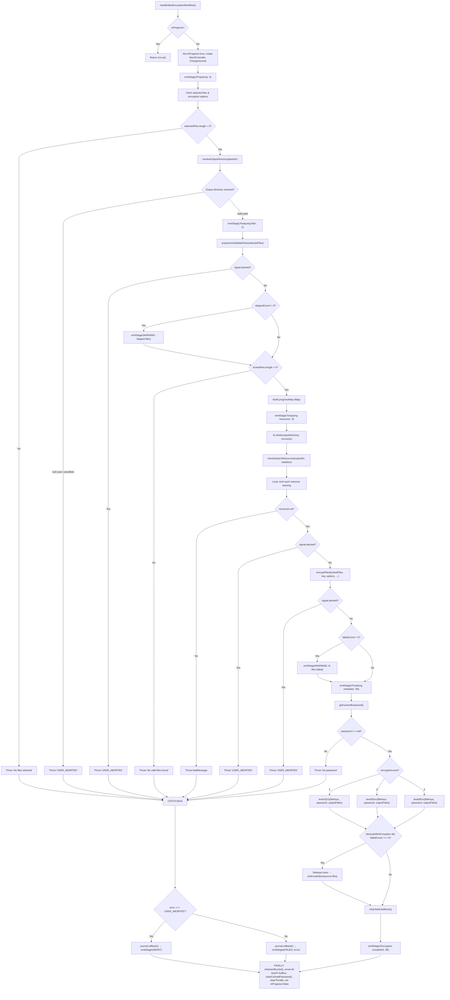

### Output Directory Resolution

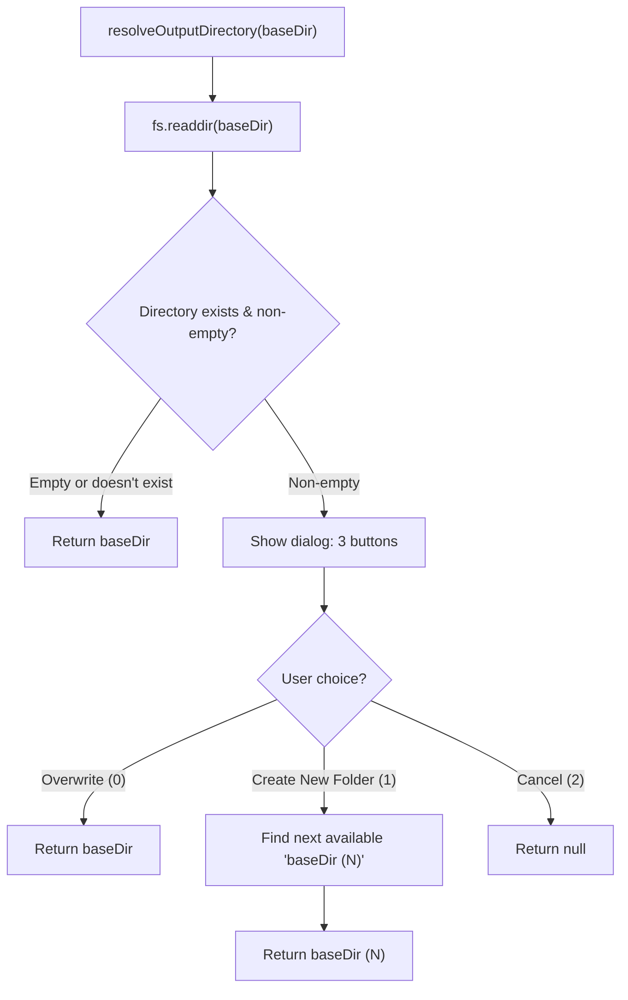

**Module:** `src/main/handlers/encryption/encryption-workflow.handler.ts`

**Decision Points:**
- **Overwrite vs New Folder:** When the output directory already contains files, the user is prompted with a native dialog offering three choices: overwrite existing content, create a numbered subfolder, or cancel the operation entirely.

### File Encryption Pipeline

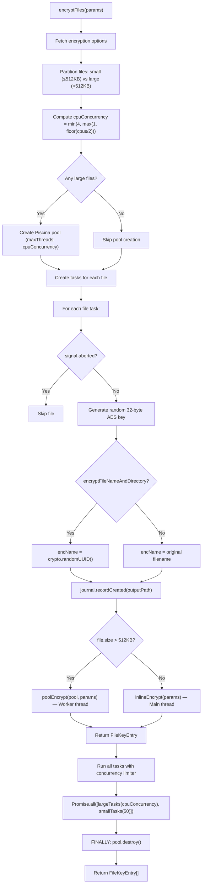

**Module:** `src/main/handlers/encryption/helpers/encrypt-files.ts`

**Decision Points:**
- **Size-Based Routing:** Files ≤512 KB are encrypted inline on the main thread. Files >512 KB are offloaded to worker threads via Piscina. This avoids the overhead of thread context-switching for small files while parallelizing large files.
- **Concurrency Limits:** Large files: `min(4, max(1, floor(cpus/2)))` concurrent. Small files: up to 50 concurrent inline tasks.
- **File Name Encryption:** When `encryptFileNameAndDirectory` is enabled, the output file is named with a random UUID. Otherwise, the original name is preserved with the encrypted extension.

### Core File Encryption (Streaming)

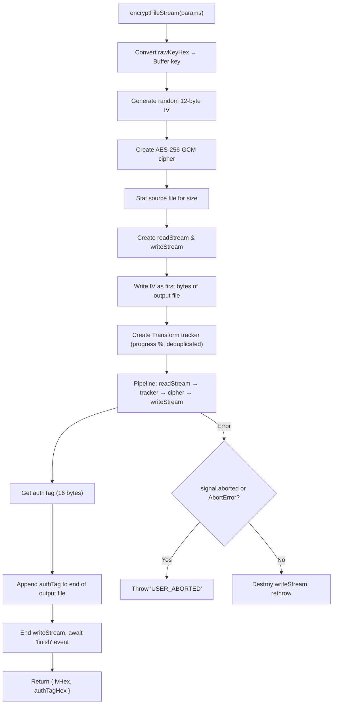

**Encrypted File Binary Format:**

```
┌──────────────┬─────────────────────────┬──────────────────┐
│  IV (12 B)   │  Encrypted Data (var)   │  AuthTag (16 B)  │
└──────────────┴─────────────────────────┴──────────────────┘
```

**Module:** `src/main/handlers/encryption/helpers/encrypt-file-core.ts`

---

## 4. Decryption Flow

> [!IMPORTANT]
> **IMPLEMENTATION UNCLEAR — REQUIRES MANUAL REVIEW**
> 
> No dedicated decryption handler, IPC channel, or UI page for decryption was found in the current codebase. The "Open Vault" menu item on the Home page is explicitly marked as `disabled: true` in `MenuCard.tsx`. While the `key-management.ts` module contains the cryptographic primitives needed for decryption (metadata deserialization, key unwrapping), there is no user-facing decryption workflow implemented at this time. The `level1Enc` / `level2Enc` / `level3Enc` functions only handle the encryption direction; no corresponding `level1Dec` / `level2Dec` / `level3Dec` functions exist.

---

## 5. Metadata Flow

### Metadata Serialization (Binary Protocol)

The metadata system uses a custom binary serialization protocol to avoid V8 string objects lingering in memory (a security measure for sensitive data).

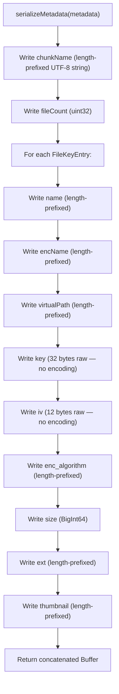

**Binary Wire Format:**

```
┌──────────────────────────┐
│  chunkName length (u32)  │
│  chunkName (UTF-8)       │
├──────────────────────────┤
│  entry count (u32)       │
├──────────────────────────┤
│  Entry 1:                │
│    name len (u32) + data │
│    encName len + data    │
│    virtualPath len + data│
│    key (32 bytes raw)    │
│    iv (12 bytes raw)     │
│    algorithm len + data  │
│    size (BigInt64)       │
│    ext len + data        │
│    thumbnail len + data  │
├──────────────────────────┤
│  Entry 2: ...            │
└──────────────────────────┘
```

**Module:** `src/main/handlers/encryption/helpers/key-management.ts`

### Level-Specific Metadata Encryption

After file encryption completes, the file key entries are serialized into the binary format above, then encrypted and written to disk according to the chosen encryption level:

**Level 1 (Password-Only):**
```
┌────────────────────────────────────────────────┐
│ Magic: "BEV1" (4 bytes)                        │
│ Salt (16 bytes)                                │
│ passWrap.iv (12 bytes)                         │
│ passWrap.authTag (16 bytes)                    │
│ passWrap.encryptedData (32 bytes — wrapped DEK)│
│ backupWrap.iv (12 bytes)                       │
│ backupWrap.authTag (16 bytes)                  │
│ backupWrap.encryptedData (32 bytes)            │
│ metadata.iv (12 bytes)                         │
│ metadata.authTag (16 bytes)                    │
│ metadata.encryptedData (variable)              │
└────────────────────────────────────────────────┘
```

**Level 2 (Password + TPM):**
- Same structure but with magic `"BVK2"`.
- The DEK is first encrypted by the TPM (`tpmEncrypt(dek)` → 256 bytes), then password-wrapped.
- `passWrap.encryptedData` is 256 bytes (TPM-encrypted DEK).

**Level 3 (Password + TPM + Key File):**
- Same as Level 2 but with magic `"BVK3"`.
- Additionally generates a 64-byte random key file with header `"BVK3_KEYFILE"`.
- Recovery key is `HMAC-SHA256(recoveryPhraseKey, keyFilePayload)`.
- Produces three output files: metadata file, recovery phrase text file, and binary key file.

**Module:** `src/main/handlers/encryption/helpers/key-management.ts`

---

## 6. Recovery Flow

### Recovery Phrase Generation

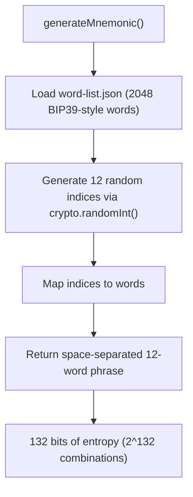

### Recovery Key Derivation

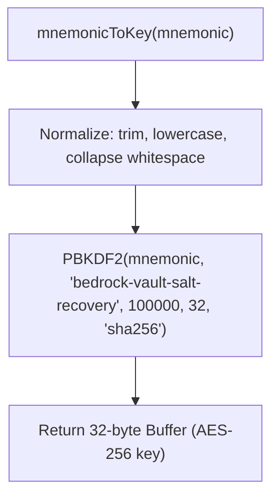

### Per-Level Recovery Process

| Level | Recovery Inputs | Process |
|---|---|---|
| Level 1 | Recovery phrase (12 words) | Derive recovery key from mnemonic → decrypt `backupWrap` → get DEK → decrypt metadata |
| Level 2 | Recovery phrase (12 words) | Same as Level 1 — recovery wraps the raw DEK directly (bypasses TPM) |
| Level 3 | Recovery phrase (12 words) + Key file | Derive mnemonic key → load key file → `HMAC-SHA256(mnemonicKey, keyFilePayload)` → decrypt `backupWrap` → get DEK → decrypt metadata |

> [!WARNING]
> The actual user-facing recovery/decryption workflow is **not yet implemented** in the UI. The recovery primitives exist in `key-management.ts` and `mnemonic.ts`, but no IPC handler or renderer page invokes them.

**Module:** `src/main/utils/mnemonic.ts`, `src/main/handlers/encryption/helpers/key-management.ts`

---

## 7. Threading Flow

### Thread Pool Architecture

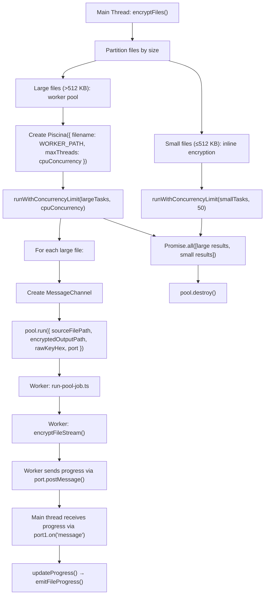

**Concurrency Computation:**
```
cpuConcurrency = min(4, max(1, floor(os.cpus().length / 2)))
```

Example: 8-core CPU → `min(4, max(1, 4))` = 4 threads.

**Worker Entry Point:** `src/main/handlers/encryption/helpers/run-pool-job.ts`  
**Worker Implementation:** Calls `encryptFileStream()` from `encrypt-file-core.ts`, reports progress via `MessagePort`.

**Progress Communication:**
- Workers send `{ type: 'progress', percent: number }` via `MessagePort`.
- Main thread receives these on `port1` and calls `updateProgress()`.
- `emitFileProgress()` throttles updates to the renderer at 150ms intervals (~6.6 FPS).

**Module:** `src/main/handlers/encryption/helpers/encrypt-files.ts`, `src/main/handlers/encryption/helpers/run-pool-job.ts`

---

## 8. IPC Flow

### Complete IPC Channel Map

All IPC channels are registered in `src/main/ipc-handler.ts` via `ipcMain.handle()`.

#### File Selection Channels

| Channel | Direction | Handler | Return Type |
|---|---|---|---|
| `add-selected-files` | Renderer → Main | `handleFileSelectionAddFiles` | `void` |
| `add-selected-folder` | Renderer → Main | `handleFileSelectionAddFolder` | `void` |
| `remove-selected-item` | Renderer → Main | `handleFileSelectionRemoveItem` | `void` |
| `clear-selected-items` | Renderer → Main | `clearSelectedItems` | `void` |
| `get-selected-files-state` | Renderer → Main | `fetchSelectedFilesState` | `SelectedFilesState` |
| `get-current-path-files` | Renderer → Main | `fetchCurrentPathSelectedFiles` | `SelectedFile[]` |
| `save-selected-files-options` | Renderer → Main | `updateFileSelectionOptions` | `SaveResult<FileSelectionOptions>` |

#### Encryption Options Channels

| Channel | Direction | Handler | Return Type |
|---|---|---|---|
| `get-encryption-options` | Renderer → Main | `fetchEncryptionOptions` | `EncryptionOptions` |
| `save-encryption-options` | Renderer → Main | `updateEncryptionOptions` | `SaveResult<EncryptionOptions>` |
| `select-encrypted-output-directory` | Renderer → Main | `selectEncryptionOutputDirectory` | `string \| null` |
| `select-recovery-phrase-save-path` | Renderer → Main | `selectRecoveryPhraseSavePath` | `string \| null` |
| `select-file-key-save-path` | Renderer → Main | `selectFileKeySavePath` | `string \| null` |
| `prompt-and-set-password` | Renderer → Main | `setEncryptionPassword` | `boolean` |
| `has-encryption-password` | Renderer → Main | `hasEncryptionPassword` | `boolean` |
| `clear-encryption-password` | Renderer → Main | `clearCachedPassword` | `void` |
| `is-tpm-available` | Renderer → Main | `isTpmAvailable` | `boolean` |
| `is-software-ksp-available` | Renderer → Main | `isSoftwareKspAvailable` | `boolean` |

#### Encryption Execution Channels

| Channel | Direction | Handler | Return Type |
|---|---|---|---|
| `start-encryption-flow` | Renderer → Main | `handleStartEncryptionWorkflow` | `void` |
| `abort-encryption-flow` | Renderer → Main | `abortEncryption` | `void` |

#### Main → Renderer Event Channels

| Channel | Direction | Payload |
|---|---|---|
| `encryption-stage-update` | Main → Renderer | `EncryptionStage { type, message, progress }` |
| `encryption-file-progress` | Main → Renderer | `EncryptionProgress[]` (sorted: encrypting first) |
| `popup:show` | Main → Renderer | `PopupPayload { type, message, closable }` |
| `log-updated` | Main → Renderer | `void` (notification only) |

#### App Configuration Channels

| Channel | Direction | Handler | Return Type |
|---|---|---|---|
| `get-app-config` | Renderer → Main | `fetchAppConfiguration` | `AppConfig` |
| `save-app-config` | Renderer → Main | `updateAppConfiguration` | `AppConfig` |

#### Window Management Channels

| Channel | Direction | Handler |
|---|---|---|
| `window:minimize` | Renderer → Main | `BrowserWindow.minimize()` |
| `window:close` | Renderer → Main | `BrowserWindow.close()` |
| `open-dev-tools` | Renderer → Main | `openDevTools({ mode: 'detach' })` |

#### Shell & Miscellaneous Channels

| Channel | Direction | Handler | Return Type |
|---|---|---|---|
| `open-file-with-sys-app` | Renderer → Main | `openPathWithSysApp` | `void` |
| `open-external-url` | Renderer → Main | `openExternalUrl` | `void` |
| `get-app-update-info` | Renderer → Main | `getAppUpdateInfo` | Stub object |
| `get-cloud-status` | Renderer → Main | `getCloudStatus` | Stub `CloudStatus` |

#### Logging Channels

| Channel | Direction | Handler | Return Type |
|---|---|---|---|
| `app-log` | Renderer → Main | `logRenderer` | `void` |
| `fetch-logs` | Renderer → Main | `fetchLogs` | `{ main, renderer, logsDir }` |
| `view-logs-folder` | Renderer → Main | `viewLogsFolder` | `void` |
| `open-logs-window` | Renderer → Main | `createLogsWindow` | `void` |

### Preload Bridge Architecture

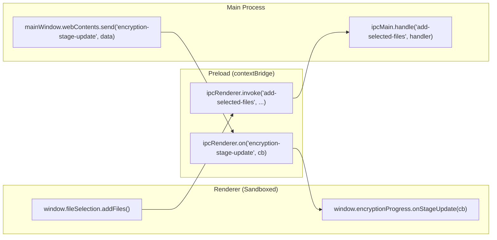

**Module:** `src/preload/preload.ts`

The preload exposes 7 namespaces on `window`: `appWindow`, `appConfig`, `fileSelection`, `encryptionOptions`, `encryptionProgress`, `cloudDrive`, `appLogs`. Each namespace maps 1:1 to IPC channels.

---

## 9. Validation Flow

### Multi-Layer Validation Architecture

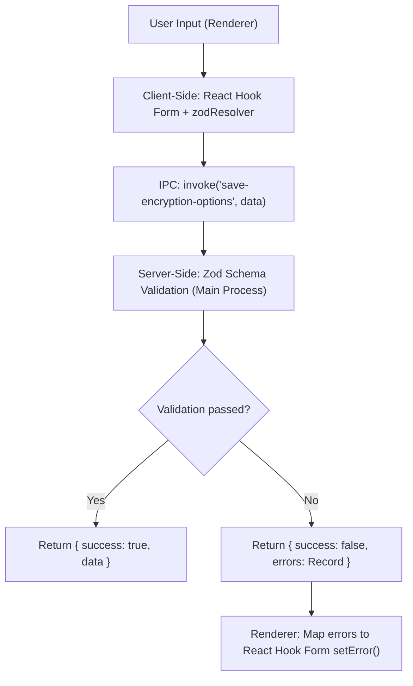

### Encryption Options Validation (Zod Schema)

**Schema:** `EncryptionOptionsSchema` in `src/main/handlers/encryption/encryption-options.store.ts`

| Field | Type | Validation Rules |
|---|---|---|
| `encryptionLevel` | number | Must be 1, 2, or 3 |
| `fileOutputDirectory` | string | Validated by `validatePath()` |
| `recoveryPhrasePath` | string | Validated by `validatePath()` |
| `recoveryPhraseFilePath` | string (optional) | Validated by `validatePath()` if present |
| `encryptFileNameAndDirectory` | boolean | Required |
| `addToCloudSync` | boolean | Required |
| `addTrap` | boolean | Required |
| `cleanupAfterEncryption` | boolean | Required |

### File Selection Options Validation (Zod Schema)

**Schema:** `FileSelectionOptionsSchema` in `src/main/handlers/file-selection/file-selection.utils.ts`

| Field | Type | Validation Rules |
|---|---|---|
| `newChunk` | boolean | Required |
| `chunkName` | string | If `newChunk` is true, must be non-empty (`.refine()`) |
| `includeSubFolders` | boolean | Required |
| `maxSize` | number | Must be ≥ 0 |
| `documents` | boolean | Required |
| `audio` | boolean | Required |
| `video` | boolean | Required |
| `pictures` | boolean | Required |
| `programs` | boolean | Required |
| `others` | boolean | Required |

### App Config Validation (Zod Schema)

**Schema:** `AppConfigSchema` in `src/main/handlers/config/app-config.handler.ts`

| Field | Type | Validation Rules |
|---|---|---|
| `initialized` | boolean | Required |
| `theme` | enum | `'light' \| 'dark' \| 'system'` |
| `shouldUpdate` | boolean | Required |

### Path Validation

**Function:** `validatePath()` in `src/main/utils/paths.ts`

| Check | Condition | Result |
|---|---|---|
| Empty/null | `!inputPath` or empty string | Reject |
| Null bytes | Contains `\0` | Reject (path injection attack) |
| Linux system paths | Matches `/etc`, `/var`, `/usr`, `/bin`, `/sbin`, `/dev`, `/proc`, `/sys`, `/root`, or `~/.hidden` | Reject |
| Windows system paths | Matches `C:\Windows`, `C:\Program Files`, `C:\ProgramData`, or `AppData` | Reject |
| Valid | None of the above | Accept |

### File Type Filtering

**Function:** `isFileTypeAllowed()` in `src/main/handlers/file-selection/file-selection.utils.ts`

Checks file extension against category maps:

| Category | Extensions |
|---|---|
| `documents` | `.pdf, .doc, .docx, .txt, .xlsx, .csv, .rtf` |
| `audio` | `.mp3, .wav, .ogg, .flac, .m4a` |
| `video` | `.mp4, .mkv, .avi, .mov, .wmv` |
| `pictures` | `.jpg, .jpeg, .png, .gif, .webp, .svg` |
| `programs` | `.exe, .msi, .app, .sh, .bat, .dmg, .pkg` |
| `others` | Any extension NOT in the above categories |

**Module:** `src/main/handlers/file-selection/file-selection.constants.ts`

### Pre-Encryption System Resource Validation

**Function:** `checkSystemResources()` in `src/main/utils/checkSystemResources.ts`

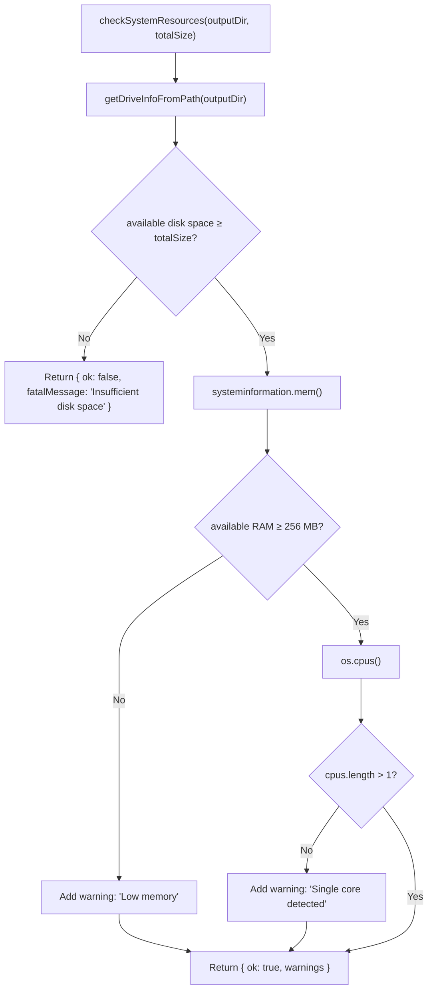

---

## 10. Error Handling Flow

### Error Handling Strategy by Layer

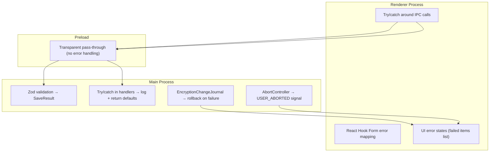

### Encryption Error Handling (Detailed)

| Error Source | Detection | Response | User Impact |
|---|---|---|---|
| No files selected | `selectedFiles.length === 0` | Throw → FAILED stage | Error popup |
| User cancelled output dir | `resolveOutputDirectory() === null` | Throw USER_ABORTED → ABORT stage | Cancellation message |
| No valid files after validation | `lockedFiles.length === 0` | Throw → FAILED stage | Error popup |
| Insufficient disk space | `checkSystemResources().ok === false` | Throw fatal → FAILED stage | Error popup with size info |
| Individual file encryption failure | Per-file try/catch in task | Mark file as failed, continue others | Warning + failed items list |
| User abort during encryption | `signal.aborted` checked at 4 points | Throw USER_ABORTED → rollback created files | Cancellation message |
| Password not cached | `getCachedPassword() === null` | Throw → FAILED stage | Error popup |
| TPM unavailable (Level 2/3) | Native addon check | Determined at options configuration time | UI disables level 2/3 |

### Transaction Rollback (Change Journal)

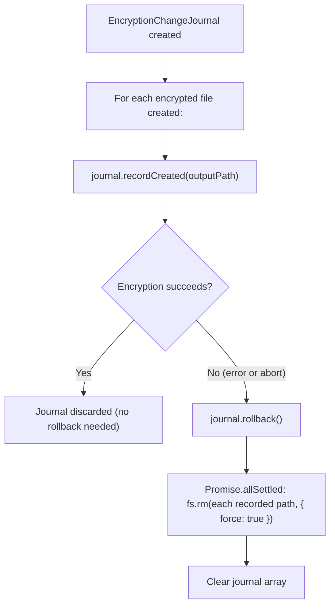

**Module:** `src/main/handlers/encryption/helpers/encryption-change-journal.ts`

### Config Error Recovery

| Scenario | Handler | Recovery |
|---|---|---|
| Config file missing (`ENOENT`) | `fetchAppConfiguration()` | Return default config silently |
| Config file corrupted (parse error) | `fetchAppConfiguration()` | Log error, return default config |
| Encryption options file corrupted | `fetchEncryptionOptions()` | Log error, **delete corrupt file**, return defaults |
| Selected files file corrupted | `loadPersistedSelectionState()` | Return default state (empty selection) |
| Legacy selected files format | `parsePersistedSelectionState()` | Auto-migrate from array format to new format |

---

## 11. Logging Flow

### Logging Architecture

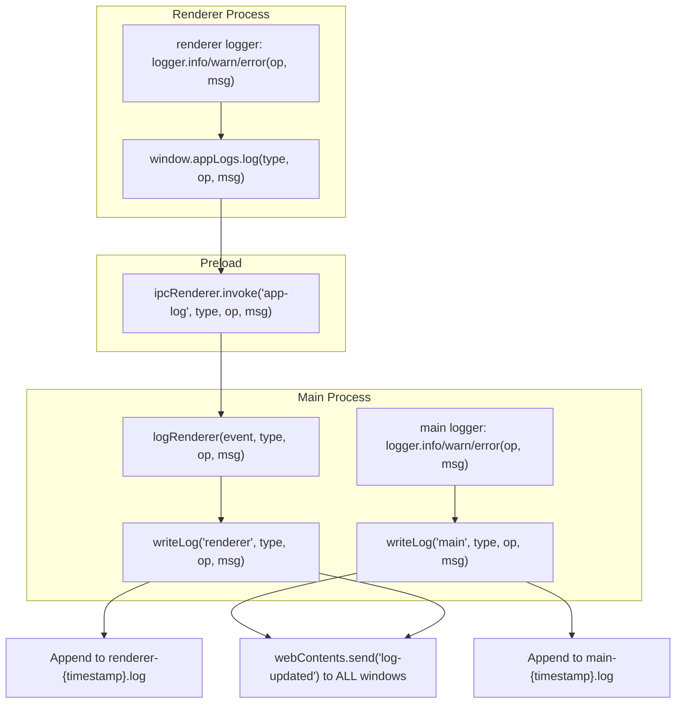

### Log File Structure

**Location:** `{userData}/logs/`

| File | Content |
|---|---|
| `main-{ISO timestamp}.log` | Main process logs |
| `renderer-{ISO timestamp}.log` | Renderer process logs |
| `main-latest.log` | Symlink → current main log |
| `renderer-latest.log` | Symlink → current renderer log |

**Log Line Format:**
```
2026-06-03T06:14:34.123Z [INFO ] Navigation Navigated to /file-selection
2026-06-03T06:14:35.456Z [WARN ] SystemResources Low memory detected: 200 MB available
2026-06-03T06:14:36.789Z [ERROR] EncryptionWorkflow Failed to encrypt file: access denied
```

**Log Levels:** `INFO`, `WARN`, `ERROR` (defined as `LogType` union in `src/main/utils/logger.ts`)

### Log Viewer UI

**Page:** `src/renderer/pages/Logs/page.tsx`

Features:
- Fetches logs via `window.appLogs.fetchLogs()` returning `{ main, renderer, logsDir }`.
- Real-time updates via `window.appLogs.onLogUpdate(callback)`.
- Open logs folder in system explorer via `window.appLogs.viewFolder()`.
- Open logs in a separate window via `window.appLogs.openWindow()` → creates logs window at `#/logs` route.

**Module:** `src/main/utils/logger.ts`

---

## 12. Security Flow

### Password Handling Security Model

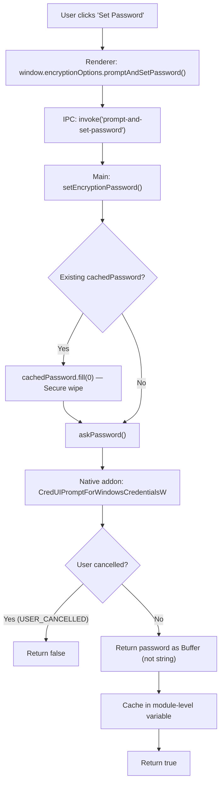

**Security Properties:**
1. **Buffer-based storage:** Password is stored as a `Buffer`, not a JavaScript `string`. Buffers can be explicitly wiped with `.fill(0)`, while strings are immutable and may linger in V8's heap.
2. **Secure wipe on reuse:** Before caching a new password, the old buffer is zeroed.
3. **Wipe after use:** In the `finally` block of `handleStartEncryptionWorkflow()`, `clearCachedPassword()` is called, which zeroes and nulls the buffer.
4. **Never stored to disk:** The password only exists in memory during the encryption workflow. It is never persisted.
5. **Native credential dialog:** Uses Windows `CredUIPromptForWindowsCredentialsW`, which provides OS-level secure input (no keylogging via browser devtools, input is not in DOM).

### Key Material Lifecycle

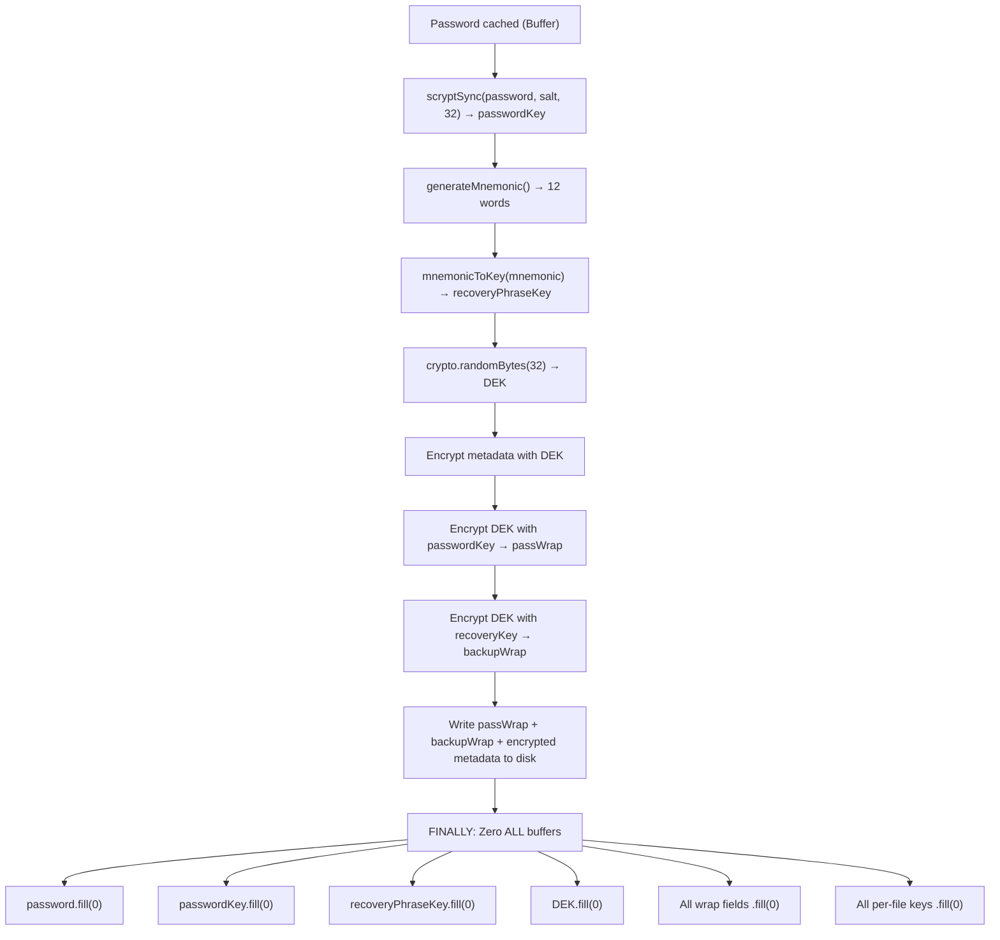

**Module:** `src/main/handlers/encryption/helpers/key-management.ts`

### Cryptographic Primitives

| Operation | Algorithm | Parameters |
|---|---|---|
| File encryption | AES-256-GCM | 32-byte key, 12-byte random IV, 16-byte auth tag |
| Metadata encryption | AES-256-GCM | 32-byte DEK, 12-byte random IV |
| Password key derivation | scrypt | N=131072 (2^17), r=8, p=1, keyLen=32, maxmem=256MB |
| Recovery key derivation | PBKDF2 | 100,000 iterations, SHA-256, salt="bedrock-vault-salt-recovery" |
| Mnemonic generation | crypto.randomInt | 12 words from 2048-word BIP39 list (132 bits entropy) |
| TPM encryption (Level 2/3) | RSA (via NCrypt) | TPM Platform Crypto Provider, PKCS1 padding |
| Key file HMAC (Level 3) | HMAC-SHA256 | key=recoveryPhraseKey, data=keyFilePayload |

### File Locking (Concurrent Access Prevention)

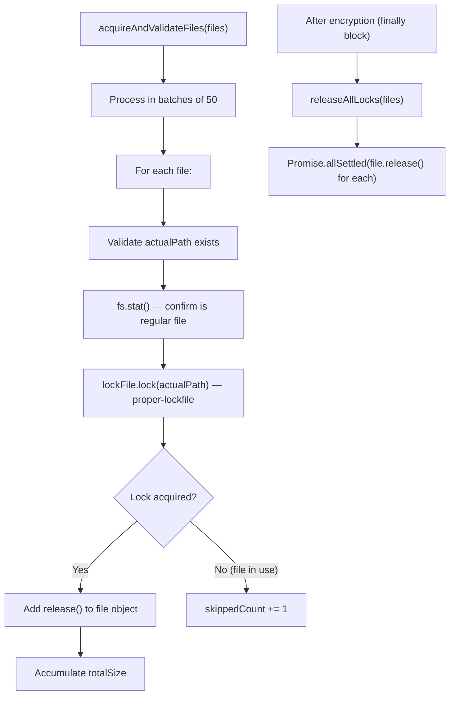

**Module:** `src/main/handlers/encryption/helpers/acquire-and-validate-files.ts`

### Shell Command Security

**URL Opening (`openExternalUrl`):**
1. Parse URL with `new URL()`.
2. **Protocol whitelist:** Only `http:` and `https:` allowed. Blocks `file:`, `javascript:`, `data:`, etc.
3. **Domain allowlist:** `['github.com', 'shawkath646.pro', 'cloudburstlab.vercel.app']`. Subdomains allowed.

**File Opening (`openPathWithSysApp`):**
1. Fetch all currently selected files via `fetchAllSelectedItems()`.
2. Verify that the requested `filePath` matches the `actualPath` of at least one selected file.
3. If not found → throw `"Unauthorized file access request"`.

**Path Validation (`validatePath`):**
- Blocks system-critical directories on both Linux and Windows.
- Strips null bytes to prevent path injection attacks.

**Module:** `src/main/handlers/miscellaneous/shell-commands.ts`, `src/main/utils/paths.ts`

### SafeRouting (Setup Guard)

All routes except `/setup` and `*` (NotFound) are wrapped in `<SafeRouting>`. This component reads `config.initialized` from `AppConfigContext`. If the app has not been initialized (first run), the user is forcibly redirected to the Setup Wizard. This prevents access to any encryption functionality before the user has completed initial configuration.

**Module:** `src/renderer/components/SafeRouting.tsx`

---

## Appendix A: File Tree Summary

```
src/
├── main/
│   ├── main.ts                          # App entry point, single-instance lock
│   ├── window-manager.ts                # BrowserWindow creation (main + logs)
│   ├── ipc-handler.ts                   # Central IPC registration hub (35 channels)
│   ├── constant/
│   │   └── word-list.json               # 2048 BIP39 words for mnemonic generation
│   ├── handlers/
│   │   ├── encryption/
│   │   │   ├── encryption-workflow.handler.ts   # Master encryption orchestrator
│   │   │   ├── encryption-options.store.ts      # Options persistence + Zod validation
│   │   │   └── helpers/
│   │   │       ├── acquire-and-validate-files.ts # File validation + locking
│   │   │       ├── encrypt-files.ts              # Parallel encryption orchestrator
│   │   │       ├── encrypt-file-core.ts          # Streaming AES-256-GCM encryption
│   │   │       ├── key-management.ts             # 3-tier key wrapping + binary metadata
│   │   │       ├── encryption-change-journal.ts  # Transaction rollback support
│   │   │       ├── encryption-emitter.ts         # Throttled progress events
│   │   │       └── run-pool-job.ts               # Worker thread entry point
│   │   ├── file-selection/
│   │   │   ├── file-selection.handler.ts         # File/folder selection management
│   │   │   ├── file-selection.utils.ts           # Virtual path, Zod schemas, type filtering
│   │   │   └── file-selection.constants.ts       # Extension → category maps
│   │   ├── config/
│   │   │   └── app-config.handler.ts             # Persistent app configuration
│   │   ├── cloud-sync/
│   │   │   └── status.ts                         # STUB: hardcoded cloud status
│   │   ├── storage/
│   │   │   └── storage-info.handler.ts           # Disk space queries
│   │   └── miscellaneous/
│   │       ├── popup.emitter.ts                  # EventEmitter → renderer popups
│   │       ├── shell-commands.ts                 # Secure URL/file opening
│   │       └── app-update.ts                     # STUB: hardcoded update info
│   ├── native/
│   │   └── native_prompt.node                    # Pre-built native addon
│   └── utils/
│       ├── logger.ts                             # Disk-based structured logging
│       ├── paths.ts                              # Path resolution + validation
│       ├── askPassword.ts                        # Native password prompt wrapper
│       ├── checkSystemResources.ts               # Pre-flight resource checks
│       ├── getDriveInfoFromPath.ts               # Drive/partition detection
│       ├── mnemonic.ts                           # BIP39 mnemonic generation + key derivation
│       └── tpm-communication.ts                  # TPM encrypt/decrypt wrapper
├── native/
│   └── main.cpp                                  # C++ N-API: CredUI + TPM/NCrypt
├── preload/
│   └── preload.ts                                # contextBridge (7 API namespaces)
├── renderer/
│   ├── App.tsx                                   # Root component, routing, theme
│   ├── main.tsx                                  # Bootstrap: fetch config → render
│   ├── index.css                                 # Global styles
│   ├── components/
│   │   ├── GlobalPopup.tsx                       # Modal popup notification system
│   │   ├── SafeRouting.tsx                       # Setup-required route guard
│   │   ├── navigation/                           # Titlebar, sidebar components
│   │   └── ui/                                   # shadcn/ui components
│   ├── contexts/
│   │   └── AppConfigContext.tsx                   # React context for app configuration
│   ├── pages/
│   │   ├── Home/                                 # Dashboard with storage + cloud + quick actions
│   │   ├── FileSelection/                        # File picker with type filtering + options
│   │   ├── EncryptionOptions/                    # Encryption level, paths, toggles
│   │   ├── ConfirmEncryption/                    # Pre-encryption review with warnings
│   │   ├── EncryptionProgress/                   # Real-time progress + per-file status
│   │   ├── Settings/                             # Theme selection
│   │   ├── Logs/                                 # Log viewer with real-time updates
│   │   ├── About/                                # App info + credits
│   │   ├── SetupWizard/                          # 3-step initial setup
│   │   ├── Update/                               # Version info (STUB)
│   │   └── NotFound.tsx                          # 404 page
│   ├── lib/                                      # Utility functions
│   └── types/
│       └── electron.d.ts                         # Window API type declarations
└── shared/
    ├── constant/
    │   ├── encryptionOptions.ts                   # Default options + level descriptors
    │   ├── fileSelection.ts                       # Default file selection options
    │   └── metadata.json                          # App branding + version
    ├── types/
    │   ├── global.d.ts                            # AppConfig, PopupPayload, SaveResult<T>
    │   ├── fileEncryption.d.ts                    # EncryptionOptions, Progress, Stage, FileKeyEntry
    │   ├── fileSelection.d.ts                     # SelectedFile, HandleFileOptions, etc.
    │   └── cloudDrive.d.ts                        # CloudStatus, CloudDriveStatus
    └── utils/
        └── formatSize.ts                          # Bytes → human-readable string
```

## Appendix B: Stub/Placeholder Implementations

| Module | Status | Details |
|---|---|---|
| `cloud-sync/status.ts` | **STUB** | Returns hardcoded cloud status with 4 providers (Google Drive inactive, OneDrive/Dropbox/Mega active). No actual cloud integration. |
| `app-update.ts` | **STUB** | Returns hardcoded update info. No actual update-checking mechanism. |
| "Open Vault" menu item | **DISABLED** | `MenuCard.tsx` has `disabled: true`. No decryption UI exists. |
| "Encryption History" menu item | **DISABLED** | `MenuCard.tsx` has `disabled: true`. No history UI exists. |

## Appendix C: Route Map

| Path | Component | SafeRouting? | Description |
|---|---|---|---|
| `/` | `HomePage` | Yes | Dashboard with storage info, cloud status, quick actions |
| `/file-selection` | `FileSelectionPage` | Yes | File/folder picker with type filtering |
| `/encryption-options` | `EncryptionOptionsPage` | Yes | Encryption level, output path, recovery path, toggles |
| `/confirm-encryption` | `ConfirmEncryptionPage` | Yes | Review all settings before starting |
| `/encryption-progress` | `EncryptionProgressPage` | Yes | Real-time progress with per-file status |
| `/settings` | `SettingsPage` | Yes | Theme selection (light/dark/system) |
| `/logs` | `LogsPage` | Yes | Log viewer with real-time updates |
| `/about` | `AboutPage` | Yes | App info, author, publisher, version |
| `/update` | `UpdatePage` | Yes | Version info (stub) |
| `/setup` | `SetupWizardPage` | **No** | 3-step initial setup wizard |
| `*` | `NotFound` | **No** | 404 error page |
