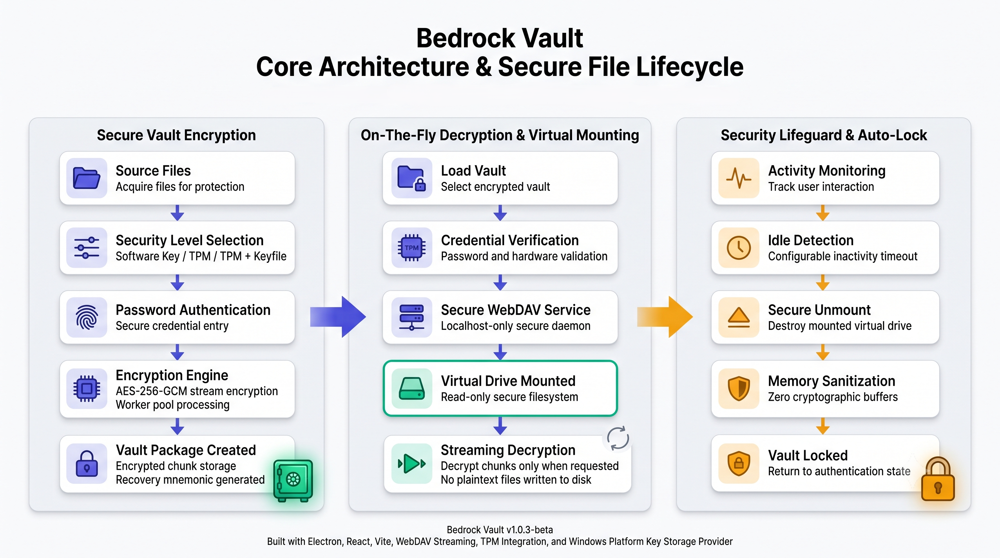

# 🛡️ Bedrock Vault

Bedrock Vault is a high-security, local-first file encryption application designed to protect your personal files, private documents, and sensitive assets. Built with modern desktop technologies, it ensures that your data remains under your absolute control before it ever reaches the cloud.

---

## 📊 System Overview Diagram

---

## 🌟 Introduction

In a world where digital privacy is constantly challenged, **Bedrock Vault** acts as your personal secure filing cabinet. It is a local desktop application that lets you lock away files using advanced, military-grade encryption keys. Your files are encrypted on your own machine, meaning no cloud provider, company, or external AI model can scan or read your data.

Unlike other zip-archiving or file-locking tools that force you to extract and expose all your files to read them, Bedrock Vault uses a **Virtual Drive** system. When you unlock a vault, it appears on your computer just like a plugged-in USB flash drive. You can open, read, and stream your files (like viewing a picture or watching a video) on-the-fly. The moment you close the vault or step away, the virtual drive disappears, leaving no unencrypted files behind on your hard drive.

---

## 🛠️ How to Use Bedrock Vault

Setting up and managing your secure vaults is designed to be straightforward and accessible:

### Step 1: Choose Files to Lock
Open Bedrock Vault and select individual files or entire folders that you want to protect. You can filter by file types (Documents, Photos, Videos, etc.) to quickly organize what goes into your vault.

### Step 2: Select Your Protection Level
Choose how strongly you want to secure your vault depending on your needs:
* **🟢 Level 1 (Standard):** Secured with a master password. Great for general privacy.
* **🟡 Level 2 (Hardware-Bound):** Combines your password with your computer's built-in security chip (**TPM**). Your vault can *only* be opened on your specific physical computer.
* **🟠 Level 3 (Maximum Hardware + Keyfile):** The ultimate lock. Requires your password, your computer's hardware chip, *and* a physical keyfile (which you can store on a USB drive).

### Step 3: Enter Your Password & Save Your Recovery Key
Set a strong master password. The app will also generate a unique **12-word recovery phrase**. Save this phrase in a secure physical location—if you ever forget your password, these 12 words are the only way to recover your data.

### Step 4: Access Your Files via the Virtual Drive
When you open an encrypted vault, Bedrock Vault mounts a virtual, read-only drive (like **Drive Z:** on Windows or a **SecureVault** volume on macOS). You can double-click files to open them in your normal applications. The file data is decrypted on-the-fly as it's read, without creating temporary unencrypted copies on your computer.

### Step 5: Lock and Walk Away
When you're done, simply click "Lock" in the app, and the virtual drive instantly unmounts, clearing all key material from your computer's memory. If you leave the vault open and walk away, the built-in **Auto-Lock Timer** will automatically lock the vault after 5 minutes of inactivity.

---

## ❓ Why Bedrock Vault?

* **Total Privacy:** Modern cloud storage is highly convenient, but it exposes your files to server breaches and automated AI indexing. Bedrock Vault keeps your files unreadable to anyone but you.
* **Endpoint Control:** Security begins on your device. By encrypting files locally *before* uploading them to any cloud drive, your data remains secure even if your cloud account is hacked.
* **Hardware-Linked Security:** Using the computer's physical security chip (TPM) prevents hackers from copying your encrypted vault and trying to crack the password on a different, faster computer.

---

## ✨ Key Features

* **🛡️ Advanced AES-256-GCM Security:** Industry-standard encryption that guarantees both absolute privacy and file integrity.
* **💾 Zero-Footprint Virtual Drives:** Open and view files directly from the encrypted vault. No unencrypted files are ever saved to your disk.
* **🔑 Hardware Bindings (TPM 2.0):** Tie your vaults directly to your machine's physical security chip.
* **📦 Two-Factor Recovery:** Bypasses hardware locks securely using a combination of a 12-word mnemonic phrase and a physical keyfile.
* **⏱️ Auto-Lock Guard:** Protects your files if you step away from your workstation by locking the vault after 5 minutes of inactivity.
* **🚀 High-Speed Multi-Threading:** Large files are encrypted in the background using multiple CPU cores, keeping the app smooth and responsive.
* **🎨 Modern Interface:** Beautiful styling supporting Light, Dark, and System themes with visual alerts.

## 💻 Developer & System Documentation

For developers, security auditors, or users who want to inspect the technical implementation, core algorithms, native C++ bindings, thread architectures, and IPC communication paths:

👉 Please refer to the **[Full System Flow Documentation](docs/FULL_SYSTEM_FLOW.md)**.

🛡️ For the latest vulnerability assessments, remediations, and vector score matrix (overall health score: **0.93 / 1.0**), see the **[Comprehensive Security Audit Report](docs/security_audit_report.md)**.

For information on how the system architecture diagram was created, see the **[System Diagram Generation Prompt](docs/SYSTEM_DIAGRAM_PROMPT.md)**.

---

## 🚀 Future Roadmap

### Planned (Coming Soon)
* **Cloud Sync Integration:** Easily link and upload your encrypted vaults directly to Google Drive, OneDrive, and Dropbox from inside the app.
* **Multi-Provider Redundancy:** Disperse fragments of your vaults across multiple cloud providers for maximum backup reliability.
* **Mobile Companion App:** Secure viewer apps for Android and iOS devices using their built-in secure enclaves.

### Experimental
* **Native Filesystem Mounts:** Transition from WebDAV virtual drives to high-performance FUSE drivers for faster read speeds.
* **Write-Back Support:** Enable modifying and saving files directly inside the mounted virtual drive.

---

## ⚠️ Disclaimer

**Bedrock Vault is currently in beta (v1.0.3-beta).**

While it implements standard cryptography (AES-256-GCM, Scrypt, PBKDF2) and hardware-backed key storage, all security software should undergo independent audits before being used to protect highly sensitive production assets. No software-based security architecture can guarantee absolute protection.

---

### 📋 Project Information
* **Name:** Bedrock Vault
* **Version:** 1.0.3-beta
* **Developer:** Shawkath646
* **Website:** [shawkath646.pro](https://shawkath646.pro)
* **Published By:** CloudBurst Lab
* **License:** MIT
