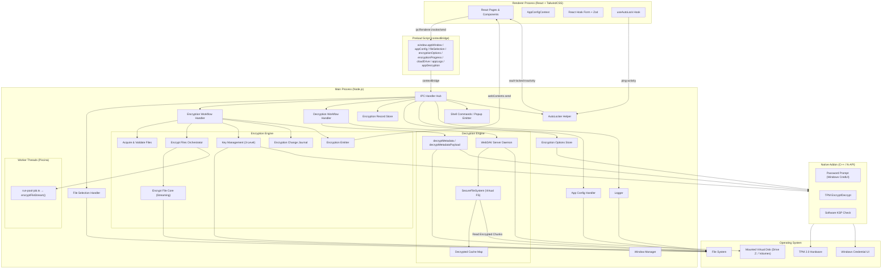
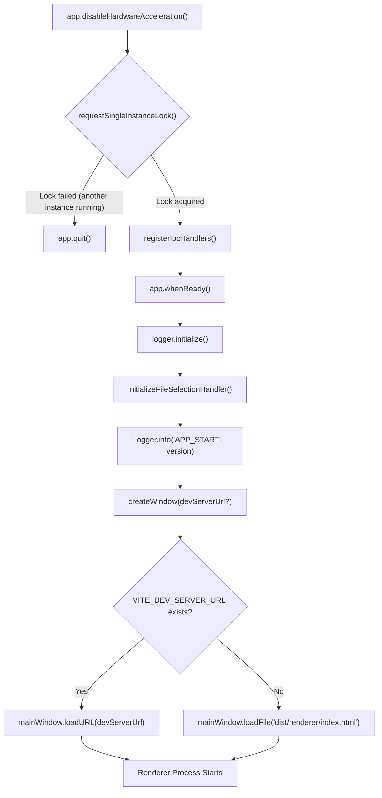
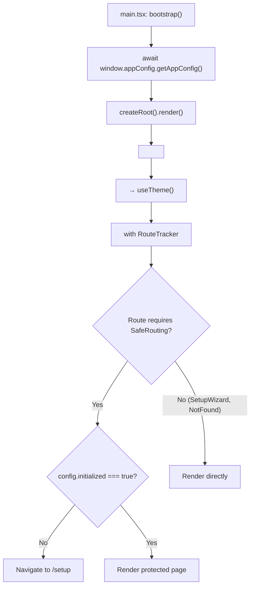
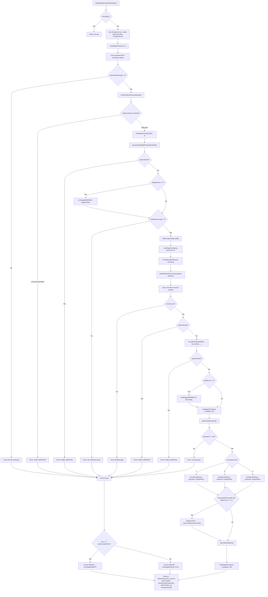
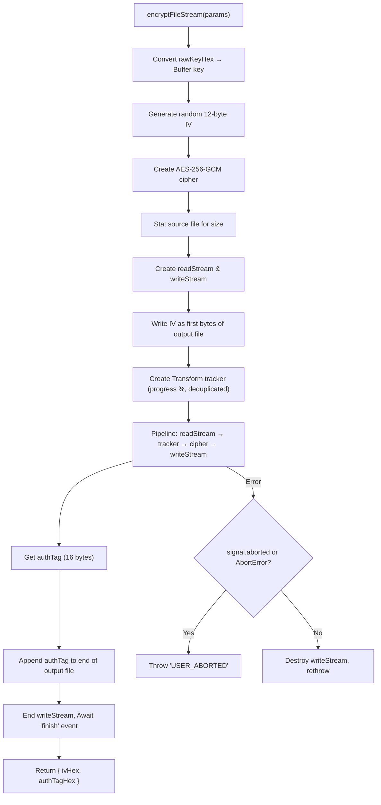
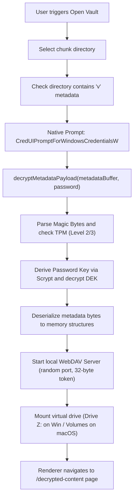
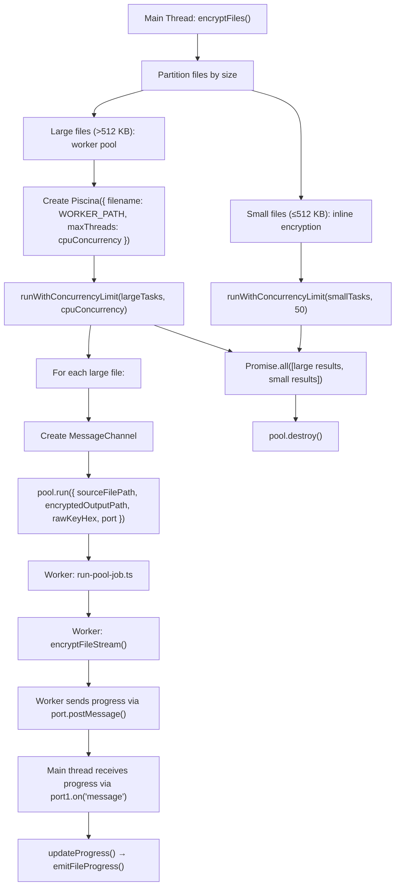
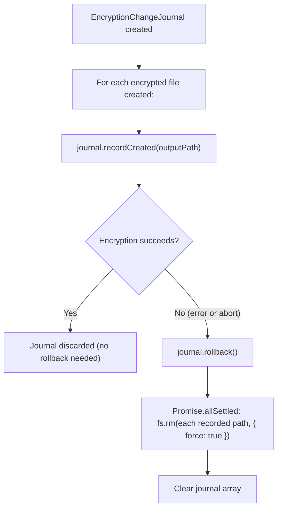
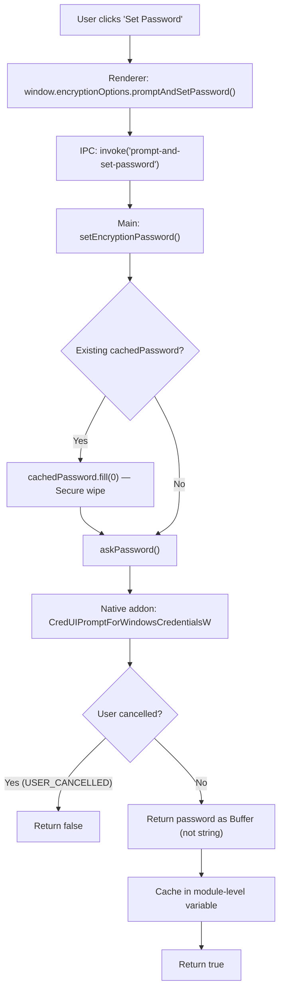

# Bedrock Vault — Full System Flow Documentation

> **Application:** Bedrock Vault v1.0.3-beta  
> **Architecture:** Electron (Main + Renderer + Preload) with Native C++ Addon  
> **Audience:** Developers, Auditors, Future Maintainers  
> **Generated From:** Complete codebase analysis — every step verified against actual implementation code.

---

## Table of Contents

1. [System Overview](#1-system-overview)
2. [User Entry Flow](#2-user-entry-flow)
3. [Encryption Flow](#3-encryption-flow)
4. [Decryption & Virtual Mount Flow](#4-decryption--virtual-mount-flow)
5. [Metadata Flow](#5-metadata-flow)
6. [Recovery Flow](#6-recovery-flow)
7. [Threading Flow](#7-threading-flow)
8. [IPC Flow](#8-ipc-flow)
9. [Validation Flow](#9-validation-flow)
10. [Error Handling Flow](#10-error-handling-flow)
11. [Logging Flow](#11-logging-flow)
12. [Security Flow](#12-security-flow)

---

## 1. System Overview

### High-Level Architecture



### Process Model

| Process | Technology | Role |
|---|---|---|
| Main Process | Node.js (Electron) | App lifecycle, IPC hub, file I/O, encryption engine, WebDAV server hosting, native addon loading, config and logs management |
| Renderer Process | React 19, TailwindCSS 4, React Hook Form, Framer Motion | User interface, client-side validation, routing, activity tracking |
| Preload Script | Electron contextBridge | Exposes secure, isolated, and typed API namespaces to the renderer |
| Worker Threads | Piscina thread pool | Parallel file chunk encryption for large files (>512 KB) |
| Native Addon | C++ (N-API, node-addon-api) | Windows Credential UI integration, Platform Key Storage Provider (TPM 2.0) bindings |

### Key Dependencies

| Dependency | Purpose |
|---|---|
| `piscina` | Multi-threaded worker pool management for offloading large-file encryption |
| `proper-lockfile` | Enforces mandatory file locks on source paths before processing |
| `webdav-server` | Hosts the local, authenticated WebDAV virtual drive server |
| `systeminformation` | Disk storage space queries for system pre-flight checks |
| `zod` | Runtime schema validation for preferences, configuration, and state schemas |
| `react-hook-form` | Form bindings and UI error mapping |
| `framer-motion` | Micro-animations and interface transition effects |

---

## 2. User Entry Flow

### Application Bootstrap



**Module:** `src/main/main.ts`

**Decision Points:**
* **Single Instance Check:** Uses `app.requestSingleInstanceLock()`. If locked, the secondary instance logs an exit and terminates immediately.
* **Launch Routing:** Detects development server ports vs built production assets in `dist/renderer`.

### Renderer Bootstrap



**Module:** `src/renderer/main.tsx`, `src/renderer/App.tsx`, `src/renderer/components/SafeRouting.tsx`

**SafeRouting Guard:** Routes except `/setup` and `*` are wrapped in `<SafeRouting>`. If the application configuration `initialized` parameter is false, users are redirected to `/setup` (the Setup Wizard) to set up encryption directories and system options.

---

## 3. Encryption Flow

### Master Encryption Workflow

Orchestrated by `handleStartEncryptionWorkflow()` in `src/main/handlers/encryption/encryption-workflow.main.ts`.



### Output Directory Resolution

If the target output directory exists and is not empty, the user is prompted with an Electron dialog containing three choices:
1. **Overwrite**: Uses the folder directly.
2. **Create New Folder**: Resolves the next available folder name suffix (e.g. `Folder (1)`).
3. **Cancel**: Halts the workflow and triggers an abort rollback.

### File Encryption Pipeline

Large files are partitioned from small files to maximize thread efficiency:
* **Threshold Boundary:** 512 KB (`INLINE_THRESHOLD_BYTES`).
* **Small Files (<= 512 KB):** Processed inline on the Electron main process thread with a maximum concurrency limit of 50 tasks.
* **Large Files (> 512 KB):** Offloaded to worker threads via **Piscina** with a concurrency limit defined as `Math.min(4, Math.max(1, Math.floor(os.cpus().length / 2)))`.
* **Change Journal:** Tracked via `EncryptionChangeJournal`. If an error or user abort occurs, the journal removes all output files written during the session to avoid partial artifacts.

### Core File Encryption (Streaming)



**Encrypted File Binary Layout:**
```
┌──────────────┬─────────────────────────┬──────────────────┐
│  IV (12 B)   │  Encrypted Data (var)   │  AuthTag (16 B)  │
└──────────────┴─────────────────────────┴──────────────────┘
```

---

## 4. Decryption & Virtual Mount Flow

Decryption reads metadata, initializes a local virtual WebDAV server, and mounts the vault on the host operating system, performing on-the-fly streaming decryption.



### Steps in the Decryption Pipeline

1. **Vault Importing:** The user selects an encrypted vault directory. The handler verifies the metadata file named `v` exists.
2. **Native Password Collection:** If a password is not cached, the application halts the main UI and calls `askPassword()`. The native compiled C++ module displays the secure OS-level credential dialog (`CredUIPromptForWindowsCredentialsW`).
3. **DEK Wrapping Resolution:**
   * **Level 1:** Uses the Scrypt-derived key to decrypt `passWrap` and extract the DEK.
   * **Level 2:** Decrypts `passWrap` to get the TPM-wrapped DEK, then passes it to the physical TPM via Windows NCrypt (`tpmDecrypt`) to recover the DEK.
   * **Level 3:** Recovers the DEK via the TPM and password. For recovery-phrase-only workflows, combines the derived PBKDF2 phrase key and the physical `key_file` payload using `HMAC-SHA256` to decrypt `backupWrap`.
4. **Metadata Deserialization:** The decrypted binary payload is parsed using the matching binary deserialization protocol. It loads files, virtual directories, and key mappings into memory cache maps:
   * `decryptedItemsMap`: Map of virtual file names and structures.
   * `childrenIndexMap`: Directory layouts.
   * `secureFileKeysMap`: Wires keys and IVs for streaming decryption.
5. **Local WebDAV Daemon Lifecycle:**
   * Spins up a `webdav-server` instance bound to localhost (`127.0.0.1`) on a random available port.
   * Restricts server path access using a secure, randomized 32-byte hexadecimal `mountToken` (e.g. `http://127.0.0.1:53213/f8c2e9...`).
   * Bypasses client browser authentication prompts by mapping HTTP `401` responses to `403` and dropping `WWW-Authenticate` response headers.
6. **OS Mounting:**
   * **Windows:** Executes `net use Z: http://127.0.0.1:${port}/${mountToken} /persistent:no` (falls back to UNC path format `\\\\127.0.0.1@${port}\\DavWWWRoot...` if standard mount fails).
   * **macOS:** Creates `/Volumes/SecureVault` mount point and executes `mount_webdav`.
7. **On-the-Fly Stream Decryption (`SecureFileSystem`):**
   * When the OS requests a read operation on a file inside the mounted drive, `SecureFileSystem._openReadStream` maps the virtual path to the corresponding physical encrypted file (`encName`).
   * Opens the file handle and reads the trailing 16-byte authentication tag (`12 + size`).
   * Instantiates a file read stream starting at byte index 12 (skipping the IV) and ending at `12 + size - 1`.
   * Pipes the file stream directly into `crypto.createDecipheriv('aes-256-gcm', key, iv)` bound with the authentication tag.
   * Outputs the decrypted stream directly to the OS file reader.
8. **Strict Read-Only Enforcement:**
   * Any writing, renaming, moving, or deleting requests directed at the virtual drive automatically fail, returning `webdav.Errors.Locked`.

---

## 5. Metadata Flow

### Metadata Serialization Protocol

To prevent raw file names, key lists, and IV maps from lingering in the V8 heap as garbage-collected string variables, the application uses a binary serialization format:

```
┌──────────────────────────┐
│  chunkName length (u32)  │
│  chunkName (UTF-8)       │
├──────────────────────────┤
│  entry count (u32)       │
├──────────────────────────┤
│  Entry 1:                │
│    name len (u32) + data │
│    encName len + data    │
│    virtualPath len + data│
│    key (32 bytes raw)    │
│    iv (12 bytes raw)     │
│    algorithm len + data  │
│    size (BigInt64)       │
│    ext len + data        │
├──────────────────────────┤
│  Entry 2: ...            │
└──────────────────────────┘
```

**Module:** `src/main/handlers/crypto-core.helpers.ts`

### Metadata Encryption Wrapper Layouts

Once serialized, the metadata buffer is encrypted with a random 32-byte DEK and packed with Level-specific wraps:

* **Level 1 (Standard Software):**
  * Magic Bytes: `"BEV1"` (4 bytes)
  * Level indicator (1 byte)
  * BigInt timestamp (8 bytes)
  * Length-prefixed chunk name
  * Salt (16 bytes)
  * `passWrap` (12-byte IV + 16-byte GCM Tag + 32-byte encrypted DEK)
  * `backupWrap` (12-byte IV + 16-byte GCM Tag + 32-byte encrypted DEK)
  * `metadataEnc` (12-byte IV + 16-byte GCM Tag + variable encrypted metadata payload)
* **Level 2 (Hardware-Bound TPM):**
  * Magic Bytes: `"BVK2"`
  * Similar structure, but `passWrap.encryptedData` is a 256-byte buffer containing the TPM-encrypted DEK wrapped with the user's password key.
* **Level 3 (Strict Hardware-Bound + Dual-Factor):**
  * Magic Bytes: `"BVK3"`
  * Generates an additional physical 64-byte key file (`BVK3_KEYFILE` header + payload).
  * `backupWrap` is encrypted with a combined key derived via `HMAC-SHA256(recoveryPhraseKey, keyfilePayload)`.

---

## 6. Recovery Flow

### Key Derivation Primitives

* **Mnemonic Phrase Generation:** Randomly selects 12 words from a 2048-word BIP39 dictionary in `word-list.json` using `crypto.randomInt()`, producing 132 bits of cryptographic entropy.
* **Mnemonic Key Derivation:** Uses PBKDF2 with 100,000 iterations, a SHA-256 digest, and a static salt `bedrock-vault-salt-recovery` to derive a 32-byte recovery key.
* **Level 3 Key Combining:** Utilizes a SHA-256 HMAC of the 64-byte keyfile payload with the recovery key as the HMAC password.

---

## 7. Threading Flow

### Piscina Worker Pool Orchestration

To maintain 60 FPS UI performance in the renderer, CPU-heavy file encryption streams are offloaded to background threads:



**Progress Throttling:** Progress updates are gathered from the main/worker threads and throttled via `THROTTLE_INTERVAL_MS` (150ms) before being sent to the React renderer, avoiding IPC congestion.

---

## 8. IPC Flow

### Register Channels (`src/main/ipc-handler.ts`)

#### File Selection
* `get-selected-files-state` → Retrieves selected files list and configuration.
* `save-selected-files-options` → Saves checkboxes/filtering preferences.
* `add-selected-files` / `add-selected-folder` → Appends files to the selection.
* `remove-selected-item` / `clear-selected-items` → Removes selection entries.
* `get-current-path-files` → Queries file list for virtual folder navigation.

#### Encryption Config & Launch
* `get-encryption-options` / `save-encryption-options` → Manages preferences.
* `select-encrypted-output-directory` → Opens directory save dialog.
* `select-recovery-phrase-save-path` / `select-file-key-save-path` → Dialog handlers.
* `prompt-and-set-password` → Invokes native password prompt.
* `has-encryption-password` / `clear-encryption-password` → Caching checks.
* `is-tpm-available` / `is-software-ksp-available` → Hardware checks.
* `start-encryption-flow` / `abort-encryption-flow` → Lifecycle handlers.

#### Decryption & Drive Mounting
* `decryption:decrypt-metadata` → Validates, decrypts, and mounts WebDAV.
* `decryption:get-current-path-files` → Lists files inside the mounted vault.
* `decryption:open-vault-file` → Maps path to virtual drive and opens.
* `decryption:lock-vault` → Unmounts WebDAV drive and sanitizes memory.
* `start-security-timer` / `stop-security-timer` (IPC On) → Manages idle timer.
* `ping-activity` (IPC On) → Resets the auto-lock security timer.

#### Registry Records
* `encryption-record:get-records` → Loads records from `record.json`.
* `encryption-record:add-record` → Imports vault records.
* `encryption-record:remove-record` → Deletes records and optionally trashes target folders.

---

## 9. Validation Flow

### Path Security Rules (`validatePath` / `ensureIsFilePath`)

Paths are validated to prevent directory traversal and system file overwrites:
* **Null Byte Check:** Paths containing `\0` are rejected.
* **Windows Exclusions:** Rejects paths targeting `C:\Windows`, `C:\Program Files`, `C:\ProgramData`, and user `AppData` directories.
* **Unix Exclusions:** Rejects paths targeting `/etc`, `/var`, `/usr`, `/bin`, `/sbin`, `/dev`, `/proc`, `/sys`, `/root`, and hidden paths.

### Pre-Flight Resource Check

* **Space Check:** Target drive must contain free space >= total source size.
* **RAM Check:** Assesses system memory; issues a warning if free memory is < 256 MB.
* **CPU Check:** Emits a warning if a single-core CPU is detected (disables Piscina load scaling).

---

## 10. Error Handling Flow

### Transaction Integrity & Failure Rollback



### Config Recovery Strategies

* **Config Missing (`ENOENT`):** Automatically initializes `config.json` with default theme and inactivity limits.
* **Preferences Corrupted:** Deletes the invalid Zod structure from `userData` and writes default options.
* **Select State Invalid:** Wipes selections and resets to an empty queue.

---

## 11. Logging Flow

* **Dual Log Files:** Written to `{userData}/logs/`.
  * `main-{timestamp}.log`: Electron backend logs.
  * `renderer-{timestamp}.log`: React user interface logs.
* **Format:** `[TIMESTAMP] [SEVERITY] [NAMESPACE] MESSAGE`
* **Renderer Log Transport:** Renderer logs are stringified and transported via the `app-log` channel to avoid serialization circular-reference blockages in Node.

---

## 12. Security Flow

### Password Lifespan & Memory Zeroing



* **Zero Memory Operations:** All cryptographic keys, IVs, wrapping variables, and password buffers are allocated as raw Node `Buffer` instances (not strings) and actively zeroed out using `Buffer.fill(0)` and native C++ `SecureZeroMemory` upon completion of the workflow.

### Auto-Lock Security Lifecycle

* **Renderer Binding:** The `useAutoLock` hook monitors active DOM interactions (`mousemove`, `keydown`, `click`, `scroll`). If the page is active and the user is on the `/decrypted-content` view, the hook pings the main process once per second via `ping-activity`.
* **Main Process Timer:** The main process runs a timer loop. If no ping is received for `inactivityTimeoutMs` (default 5 minutes), the main process executes `executeAutoLock()`:
  1. Aborts any active file selections.
  2. Unmounts the virtual drive (e.g. drive `Z:` / `/Volumes/SecureVault`).
  3. Stops the local WebDAV server instance.
  4. Calls `clearDecryptedCache()` and `clearCachedPassword()`, zeroing out all keys in memory.
  5. Sends `vault-locked-inactivity` to all windows.
  6. Opens a system message dialog alerting the user.
* **Renderer Redirection:** Upon receiving `vault-locked-inactivity`, the renderer redirects the viewport to `/` (Home page) and resets theme/routing settings.
